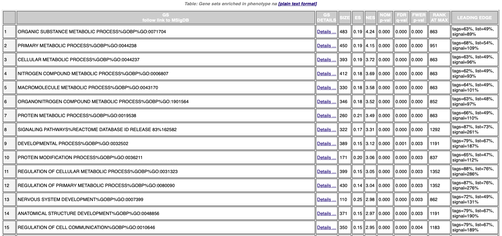
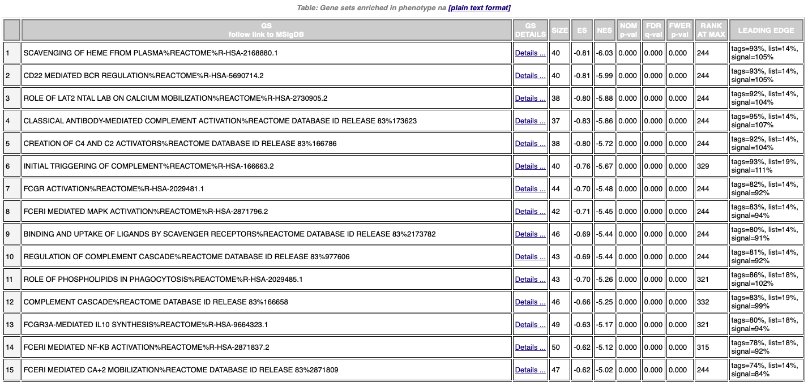
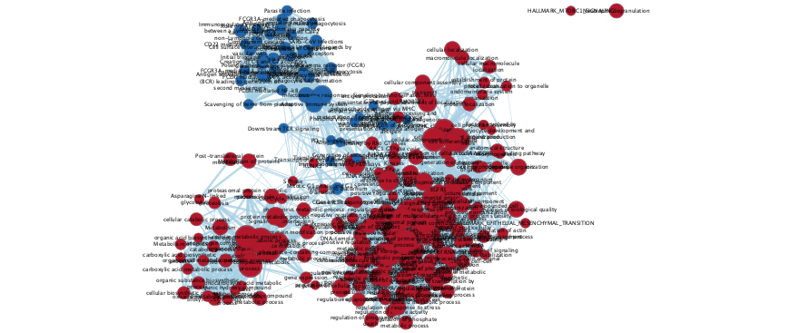
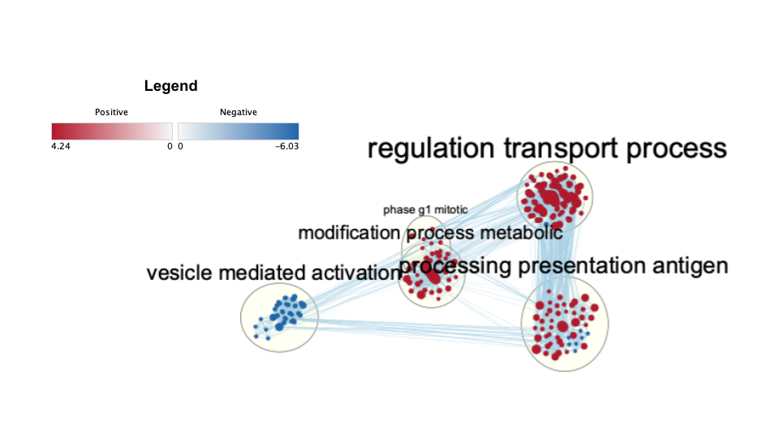

# Introduction

**What was done in A1 ?**

In A1, I sourced, cleaned and normalized dataset
[GSE184320](https://0-www-ncbi-nlm-nih-gov.brum.beds.ac.uk/geo/query/acc.cgi?acc=GSE184320).
This data is used in the study "Loss of skin and mucosal CXCR3+ resident
memory T cells causes irreversible tissue-confined immunodeficiency in
HIV". This data Includes 16 CD45+ cell samples sorted by type of tissue:
skin and peripheral blood mononuclear cells. After cleaning, mapping and
normalizing the data, 20% of the original data set remains for a total
of 11895 genes.

**What was done in A2?**

In A2, identified the pathways that are linked with genes that are
significantly upregulated or downregulated in people living with HIV
using data in the study "Loss of skin and mucosal CXCR3+ resident memory
T cells causes irreversible tissue-confined immunodeficiency in HIV".
Performed differential gene expression analysis comparing different
tissue samples. Performed ORA on upregulated genes and downregulated
genes.

-   With a p-value cutoff of 0.01, 2632 genes were found to be
    differentially expressed. After correction with the BH method at the
    same cutoff, 1795 genes remained.

-   For upregulated genes, the domain size was 445. Upregulated genes
    were involved key processes such as "epidermis development" and
    "skin development" and "extracellular region".

-   For downregualted genes, the domain size was 1465. Downregulated
    genes were involved in "adaptive immune response", "regulation of
    immune system process", and "leukocyte activation".

**Summary of experiment**

The experiment describes the impact of antiretroviral therapy (ART) on
skin tissue-resident memory T (Trm) cells in people living with HIV
(PLWH). The authors found that late ART initiation leads to permanent
depletion of skin CD45+ Trm cells, while early ART can reconstitute the
pool of Trm cells lost in early HIV infection. They also found that PLWH
receiving late ART treatment had a loss of CXCR3+ Trm cells and a
tolerogenic skin immune environment. Additionally, HPV-induced
precancerous lesion biopsies showed reduced CXCR3+ Trm cell frequencies
in the mucosa in PLWH compared to HIV-negative individuals. These
findings suggest that the irreversible loss of CXCR3+ Trm cells in skin
and mucosa of PLWH who received late ART treatment may be a contributing
factor in the development of HPV-related cancer.

**Reference to paper relevant to dataset**

Saluzzo S, Pandey RV, Gail LM, Dingelmaier-Hovorka R et al. Delayed
antiretroviral therapy in HIV-infected individuals leads to irreversible
depletion of skin- and mucosa-resident memory T cells. Immunity 2021 Dec
14;54(12):2842-2858.e5.
PMID: [34813775](https://0-www-ncbi-nlm-nih-gov.brum.beds.ac.uk/pubmed/34813775 "Link to PubMed record")

**Goal of this assignment**

For Assignment 3, the goal is to perform non-thresholded gene set
enrichment analysis to identify biological pathways and functions that
are significantly enriched in ranked set of genes from A2. Visualize the
gene set enrichment analysis in Cytoscape using an enrichment map with
annotations and appropriates figures and answer questions relating
results back to the initial data and question.

**Load dependencies**

```{r message=FALSE, warning=FALSE}
# Install the packages
if (!require(RCurl)){
  install.packages("RCurl")
}
if (!require(GSA)){
  install.packages("GSA")
}
if (!require(VennDiagram)){
  install.packages("VennDiagram")
}
if (!require(ComplexHeatmap)){
  BiocManager::install("ComplexHeatmap")
}
if (!require(circlize)){
  BiocManager::install("circlize")
}
if (!require(Biobase)){
  BiocManager::install("Biobase")
}
if (!require(knitr)){
  install.packages("knitr")
}

if (!requireNamespace("BiocManager", quietly = TRUE)){
    install.packages("BiocManager")
}
if (!requireNamespace("biomaRt", quietly = TRUE)){
    install.packages("biomaRt", force= TRUE)
}
BiocManager::install("biomaRt")

#Load the packages
library(knitr)
library(Biobase)
library(RCurl)
library(GSA)
library(VennDiagram)
library(ComplexHeatmap)
library(circlize)
library(grDevices)
library(biomaRt)
```

# Non-thresholded Gene set Enrichment Analysis

**Download the Bader lab geneset**

I used this gene set
"Human_GOBP_AllPathways_with_GO_iea_March_02_2023_symbol.gmt" from the
Bader Lab collection found at
<http://download.baderlab.org/EM_Genesets/current_release/Human/symbol/>

**Load gene ranking file**

This is the gene ranking file corrsponding to results from Assignment 2.
I had to do some adjustments to the code, such as re-matching the
EnsemblIDs with their HUGO gene names and extracting the gene name and
rank to produce the rank file.

```{r}
rank <- read.csv(file.path(getwd(), "ranked_genes.csv"))
rank
```


### Questions

1.  **What method did you use? What genesets did you use? Make sure to
    specify versions and cite your methods.**

    The ranked_genes.rnk and Bader geneset collection are used to
    perform a non-thresholded pathway analysisusing GSEA version 4.0.3.
    Default geneset size of 15-500 with 1000 permutations is used. Gene
    symbols are set to "No_Collapse."

2.  **Summarize your enrichment results.**

    POS top term:

    1.  ORGANIC SUBSTANCE METABOLIC PROCESS%GOBP%<GO:0071704>
    2.  size: 483; ES: 0.19; NES: 4.24; NOM p-val: 0.000; FDR q-val:
        0.000; FWER p-val: 0.000; rank at max: 863, leading edge: tags =
        63%, list= 49%, signal = 89%.

    NEG top term:

    1.  SCAVENGING OF HEME FROM PLASMA%REACTOME%R-HSA-2168880.1

    2.  size: 40; ES: -0.81; NES: -6.03; NOM p-val: 0.000; FDR q-val:
        0.000; FWER p-val: 0.000; rank at max: 244, leading edge: tags =
        93%, list= 14%, signal = 105%.

    **Enrichment in phenotype na_pos**

    1.  1152 / 1376 gene sets are upregulated in phenotype na_pos

    2.  600 gene sets are significant at FDR \< 25%

    3.  220 gene sets are significantly enriched at nominal pvalue \< 1%

    4.  387 gene sets are significantly enriched at nominal pvalue \< 5%

    **Enrichment in phenotype na_neg**

    1.  224 / 1376 gene sets are upregulated in phenotype na_neg

    2.  na_neg 78 gene sets are significantly enriched at FDR \< 25%

    3.  50 gene sets are significantly enriched at nominal pvalue \< 1%

    4.  62 gene sets are significantly enriched at nominal pvalue \< 5%

    5.  The dataset has 1776 features (genes) No probe set =\> gene
        symbol collapsing was requested, so all 1776 features were used
        Gene set details

    **Gene set details**

    1.  Gene set size filters (min=15, max=500) resulted in filtering
        out 18385 / 19761 gene sets

    2.  There were 30515 row(s) in total of missing data in this RNK
        file. These will be ignored.

    **Figure 1: The top 15 upregulated pathways as indicated by GSEA
    are:**



**Figure 2: Top 15 down-regulated pathways as indicated by GSEA
**

3.  **How do these results compare to the results from the thresholded
    analysis in Assignment #2. Compare qualitatively. Is this a straight
    forward comparison? Why or why not?**

**Up-regulated terms in threshold analysis from A2**

1\. Extracellular region

2\. Extracellular space

3\. Extracellular vesicle

4\. Extracellular organelle

The up-regulated gene pathways in the GSEA analysis (**Figure 1**) focus
on biological processes such as cellular metabolism, molecular signaling
and development. This is not a straight forward comparison because the
pathways and processes listed in the gene threshold analysis are vague
and seemingly unrelated to the results in the GSEA analysis. Many of
these processes are interdependent and interconnected, and they play
essential roles in maintaining cellular homeostasis and organismal
growth and development.

On the other hand, the results from the threshold analysis relate to
cellular components and structures that are located outside of the cell
membrane, in the extracellular space, such as the development and
maintenance of the epidermis and skin tissues.

**Down-regulated terms in threshold analysis from A2**

1\. Immune system process

2\. Immune response

3\. Immune system

4\. Adaptive immune response

5\. Regulation of immune system process

6\. Leukocyte activation

With regards to the down-regulated gene pathways in the GSEA analysis
(**Figure 2**), these pathways and processes are all related to the
immune system and immune response. They involve various mechanisms for
recognizing and responding to foreign substances, such as pathogens or
damaged cells. Specifically, these processes involve scavenging of heme,
regulation of complement cascade, activation of Fc receptors, creation
of complement activators, triggering of complement, and binding and
uptake of ligands by scavenger receptors.

These results are aligned with the down-regulated terms in the threshold
analysis in A2. The pathways and processes listed in the GSEA analysis
and threshold analysis, are all involved specifically with the response
to infections or cellular damage. The immune system regulates cellular
metabolic processes and signaling pathways that are involved in the
communication between immune cells and the regulation of immune
responses.

# Visualize your Gene set Enrichment Analysis in Cytoscape

### Questions

1.  **Create an enrichment map - how many nodes and how many edges in
    the resulting map? What thresholds were used to create this map?
    Make sure to record all thresholds. Include a screenshot of your
    network prior to manual layout.**

    The GSEA output was use with the EnrichmentMap App in Cytoscape
    Version: 3.9.1. The Q-value used was 0.1 and then default Edge
    Cutoff was used (0.375). There are 219 nodes and 2718 edges.

**Figure 3:** Unmodified Enrichment Map



2.  **Annotate your network - what parameters did you use to annotate
    the network. If you are using the default parameters make sure to
    list them as well.**

    The AutoAnnotate Cytoscape App was used to annotate the above
    EnrichmentMap. Layout network to prevent cluster overlap was
    selected for network readability.

    Other parameters

    1.  The Cluster source: clusterMaker2

    2.  ClusterMaker Algorithm: MCL Cluster

    3.  Edge Attribute: None

    4.  Label Maker: WordCloud Adjacent Words (default)

    5.  Max Words Per Label: 3

    6.  Minimum Word Occurrence: 1

    7.  Normalization Factor: 0.5

    8.  Attribute Names: [EnrichmentMpa::GS_DESCR]

    9.  Display Style: Clustered-Standard

    10. Max Words Per Cloud: 250

    11. Cluster Cutoff is 1.0.

<!-- -->

3.  **Make a publication ready figure - include this figure with proper
    legends in your notebook.**

    **Figure 4**: Publication ready enrichment map with legend.



4.  **Collapse your network to a theme network. What are the major
    themes present in this analysis? Do they fit with the model? Are
    there any novel pathways or themes?**

    In Cytoscape, AutoAnnotate allows users to normalize this bias by
    collapsing the network. A visualization of this is seen in **Figure
    4,** where it iseasy to quickly see the major themes of an analysis
    even within large complicated networks.

    The major themes present in this analysis are regulation transport
    process, processing presentation antigen, vesicle mediated
    activation, modification process metabolic and phase g1 mitotic.
    These major themes relate to the study because they involve
    processes related to the immune response, including the regulation
    of T cell trafficking and activation, antigen presentation,
    metabolic processes, and cell cycle regulation. While the study
    provides important insights into the mechanisms underlying the
    skin-specific immunodeficiency in PLWH, the theme network does not
    appear to identify any novel pathways or themes.

# Interpretation and detailed view of results

### Questions

1.  **Do the enrichment results support conclusions or mechanism
    discussed in the original paper? How do these results differ from
    the results you got from Assignment #2 thresholded methods**

    The GSEA enrichment results support the conclusions and mechanisms
    discussed in the original paper, specifically in the down-regualted
    terms. The down-regulation of immune-related pathways and processes
    found in the gene enrichment analysis using GSEA is relevant to the
    study because it provides further evidence for the immune
    dysfunction observed in HIV-positive individuals, particularly with
    regards to the depletion of CD4+ Trm cells in the skin. The study
    found that HIV-positive late presenters had a permanent depletion of
    cutaneous CD4+ Trm cells despite long-term ART and a good
    reconstitution of circulating CD4+ T cells. In contrast, newly
    HIV-infected, ART-naive patients had initially reduced CD4+ Trm
    cells, but these cells were reconstituted one year after starting
    ART. The results in the paper show that the skin immune environment
    is directly and profoundly changed by HIV and skewed toward an
    anti-inflammatory, tolerogenic, and possibly cancer-promoting
    environment. The study itself does not describe a direct
    relationship between up-regulated processes and the results of the
    study.
    	
    When comparing the results the enrichment analysis with the
    threshold analysis there are more similaries in the down-regulated
    processes and pathways than there are in the up-regulated processes
    and pathways. More specifically, the up-regulated gene pathways in
    the GSEA analysis (**Figure 1**) focus on biological processes such
    as cellular metabolism, molecular signaling and development. Many of
    these processes are interdependent and interconnected, and they play
    essential roles in maintaining cellular homeostasis and organismal
    growth and development. Whereas the results from the threshold
    analysis relate to cellular components and structures that are
    located outside of the cell membrane, in the extracellular space,
    such as the development and maintenance of the epidermis and skin
    tissues. While not directly identical, there are some similarities
    between the two results.

    With regards to the down-regulated gene pathways in the GSEA
    analysis (**Figure 2**), these pathways and processes are all
    related to the immune system and immune response. They involve
    various mechanisms for recognizing and responding to foreign
    substances, such as pathogens or damaged cells. Specifically, these
    processes involve scavenging of heme, regulation of complement
    cascade, activation of Fc receptors, creation of complement
    activators, triggering of complement, and binding and uptake of
    ligands by scavenger receptors.

    These results are aligned with the down-regulated terms in the
    threshold analysis in A2. The pathways and processes listed in the
    GSEA analysis and threshold analysis, are all involved specifically
    with the response to infections or cellular damage. The immune
    system regulates cellular metabolic processes and signaling pathways
    that are involved in the communication between immune cells and the
    regulation of immune responses.

2.  **Can you find evidence, i.e. publications, to support some of the
    results that you see. How does this evidence support your result?**

    Yes, there are publications and medical resources that support the
    results seen in these analysis. For example, John Hopkins Medicine
    provides an overview of various skin conditions that are commonly
    seen in people with HIV/AIDS. These conditions can be caused by
    opportunistic infections due to a weakened immune system or by an
    overactive immune system. The paper discusses several skin
    conditions, including molluscum contagiosum, herpes viruses, Kaposi
    sarcoma, oral hairy leukoplakia, thrush, photodermatitis, and
    prurigo nodularis. This can be used as evidence to support the
    results because it provides insight into how the weakened immune
    system or overactive immune system associated with HIV/AIDS can lead
    to the development of various skin conditions, including cancer.

# Dark Matter Analysis

1.  **Sometimes the most interesting information is the gene that has no
    information. In this type of pathway analysis we can only discover
    what we have already described previously in the literature or
    pathway databases. Often pathways found in one disease are
    applicable to other diseases so this technique can be very helpful.
    It is important to highlight any genes that are significantly
    differentially expressed in your model but are not annotated to any
    pathways. We refer to this set of genes as the dark matter.**

    There are different types of dark matter:

    -   Genes that are annotated but the functions they are annotated to
        get filtered out because they are either too large or too small

    -   Genes that have no annotations

    **Read-in geneset used in analysis: gmt file.**

```{r echo=T, results='hide'}
genesets <-GSA::GSA.read.gmt(paste(getwd(),
                      "Human_GOBP_AllPathways_no_GO_iea_March_02_2023_symbol.gmt",
                      sep = "/"))
names(genesets$genesets) <- genesets$geneset.names
```

**Read-in normalized count data from Assignment 2.**

```{r}
normalized_count_data <- read.csv(file.path(getwd(), "normalized_dataset.csv"))
```

**Create expression matrix from Assignment 2.**

```{r}
expressionMatrix <- as.matrix(normalized_count_data[,4:19])
rownames(expressionMatrix) <-
  normalized_count_data$HGNC
colnames(expressionMatrix) <-
  colnames(normalized_count_data)[4:19]
```

**Define our expression and rank file**

```{r}
expression <- rownames(expressionMatrix)
ranks <- read.csv(file.path(getwd(), "ranked_genes.csv"))
```

**Access GSEA directories**

```{r}
enr_file1 <- read.csv(file.path(getwd(), "gsea_na_neg.csv"))
enr_file2 <- read.csv(file.path(getwd(), "gsea_na_pos.csv"))
```

```{r}
FDR_threshold <- 0.001
#get the genes from the set of enriched pathways (no matter what threshold)
all_sig_enr_genesets<- c(rownames(enr_file1)[which(enr_file1[,"FDR.q.val"]<=FDR_threshold)], rownames(enr_file2)[which(enr_file2[,"FDR.q.val"]<=FDR_threshold)])
genes_sig_enr_gs <- c()
for(i in 1:length(all_sig_enr_genesets)){
  current_geneset <- unlist(genesets$genesets[which(genesets$geneset.names %in% all_sig_enr_genesets[i])]) 
  genes_sig_enr_gs <- union(genes_sig_enr_gs, current_geneset)
}
```

**Obtain the list of all genes in our geneset file**

```{r}
genes_all_gs <- unique(unlist(genesets$genesets))
genes_no_annotation <- setdiff(expression, genes_all_gs)
ranked_gene_no_annotation <- ranks[which(ranks[,2] %in% genes_no_annotation),]
```

**Read-in output hits**

```{r}
# output_hits <- read.csv("~/Desktop/bcb420_code/a3/output_hits.csv")
output_hits <- read.csv(file.path(getwd(), "output_hits.csv"))
```

```{r echo=FALSE}
# create a biomaRt object for the human Ensembl database
ensembl <- useMart("ensembl", dataset = "hsapiens_gene_ensembl")

# define the columns to retrieve from biomaRt
attributes <- c("ensembl_gene_id", "hgnc_symbol")

# extract Ensembl IDs from column 1 of output_hits
ensembl_ids <- output_hits[,1]

# retrieve the corresponding HGNC names from biomaRt
hgnc_names <- getBM(attributes = attributes, filters = "ensembl_gene_id", 
                    values = ensembl_ids, mart = ensembl)

# merge the Ensembl IDs and HGNC names data frames by the Ensembl ID column
output_hits_genes <- merge(output_hits, hgnc_names, by.x = 1, by.y = "ensembl_gene_id")

# rename the HGNC names column
colnames(output_hits_genes)[ncol(output_hits_genes)] <- "hgnc_symbol"
```

**Extract top hits**

```{r}
top_hits <- output_hits_genes[which(output_hits_genes$hgnc_symbol%in%ranked_gene_no_annotation$hgnc_symbol),]$hgnc_symbol[1:100]
```

**Heatmap matrix and scaling**

```{r}
heatmap_matrix <- normalized_count_data
#rownames(heatmap_matrix) <- rownames(normalized_count_data)
#colnames(heatmap_matrix) <- colnames(normalized_count_data)
heatmap_matrix_scaled <- t(scale(t(heatmap_matrix[,4:19])))

heatmap_matrix_tophits <- t(
  scale(t(heatmap_matrix_scaled[which(heatmap_matrix$HGNC %in% top_hits),])))
```

### Heatmap A

**Figure 5:** Heatmap of any significant genes that are not annotated to
any of the pathways returned in the enrichment analysis.

```{r}
# define custom color palette
my_palette <- colorRampPalette(c("blue", "white", "red"))(100)

# create the heatmap using the custom color palette
current_heatmap <- ComplexHeatmap::Heatmap(
  as.matrix(heatmap_matrix_tophits),
  name = "DE",
  cluster_rows = TRUE,
  cluster_columns = TRUE,
  show_row_dend = TRUE,
  show_column_dend = TRUE,
  use_raster = FALSE,
  col = my_palette,
  show_column_names = TRUE,
  show_row_names = FALSE,
  show_heatmap_legend = TRUE
)

current_heatmap
```

Compare this to a heatmap of the genes that are not annotated to any of
the pathways returned in the enrichment analysis, but might be annotated
to SOME pathway:

**Obtain the list of not annotated genes to any of the pathways in our
geneset file**

```{r}
genes_no_annotation <- setdiff(expression, genes_sig_enr_gs)
ranked_gene_no_annotation <- ranks[which(ranks[,2] %in% genes_no_annotation),]
```

**Extract top hits**

```{r}
top_hits <- output_hits_genes[which(output_hits_genes$hgnc_symbol%in%ranked_gene_no_annotation$hgnc_symbol),]$hgnc_symbol[1:100]
```

**Heatmap matrix and scaling**

```{r}
heatmap_matrix <- normalized_count_data
#rownames(heatmap_matrix) <- rownames(normalized_count_data)
#colnames(heatmap_matrix) <- colnames(normalized_count_data)
heatmap_matrix_scaled <- t(scale(t(heatmap_matrix[,4:19])))

heatmap_matrix_tophits <- t(
  scale(t(heatmap_matrix_scaled[which(heatmap_matrix$HGNC %in% top_hits),])))
```

### Heatmap B

**Figure 6:** Heatmap of any significant genes that are not annotated to
any pathways in entire set of pathways used for the analysis.

```{r}
# define custom color palette
my_palette <- colorRampPalette(c("blue", "white", "red"))(100)

# create the heatmap using the custom color palette
current_heatmap <- ComplexHeatmap::Heatmap(
  as.matrix(heatmap_matrix_tophits),
  name = "DE",
  cluster_rows = TRUE,
  cluster_columns = TRUE,
  show_row_dend = TRUE,
  show_column_dend = TRUE,
  use_raster = FALSE,
  col = my_palette,
  show_column_names = TRUE,
  show_row_names = FALSE,
  show_heatmap_legend = TRUE
)

current_heatmap
```

The high degree of similarity between the two heatmaps suggests that the
presence of dark matter is likely caused by an annotation problem rather
than the absence of genes from enriched pathways.

# References

1.  Reimand J, Isserlin R, Voisin V, Kucera M, Tannus-Lopes C,
    Rostamianfar A, Wadi L, Meyer M, Wong J, Xu C, Merico D, Bader GD.
    Pathway enrichment analysis and visualization of omics data using
    g:Profiler, GSEA, Cytoscape and EnrichmentMap. Nat Protoc. 2019
    Feb;14(2):482-517 [PubmedLinks to an external
    site.](https://www.ncbi.nlm.nih.gov/pubmed/30664679)

2.  Merico D, Isserlin R, Stueker O, Emili A, Bader GD Enrichment Map: A
    Network-Based Method for Gene-Set Enrichment Visualization and
    Interpretation PLoS One. 2010 Nov 15;5(11) T

3.  Subramanian, A., Tamayo, P., et al. (2005, PNAS). Mootha, V. K.,
    Lindgren, C. M., et al. (2003, Nature Genetics). For use of the
    Molecular Signatures Database (MSigDB), to cite please reference one
    or more of the following as appropriate, along with the source for
    the gene set as listed on the gene set page:

4.  Liberzon A, et al. (Bioinformatics, 2011). Liberzon A, et al. (Cell
    Systems 2015).

5.  Saluzzo S, Pandey RV, Gail LM, Dingelmaier-Hovorka R et al. Delayed
    antiretroviral therapy in HIV-infected individuals leads to
    irreversible depletion of skin- and mucosa-resident memory T cells.
    Immunity 2021 Dec 14;54(12):2842-2858.e5.
    PMID: [34813775](https://0-www-ncbi-nlm-nih-gov.brum.beds.ac.uk/pubmed/34813775 "Link to PubMed record")

6.  Morgan M (2023). \_BiocManager: Access the Bioconductor Project
    Package Repository\_. R package version 1.30.20,
    <https://CRAN.R-project.org/package=BiocManager>.

7.  Gu, Z. (2016) Complex heatmaps reveal patterns and correlations in
    multidimensional genomic data. Bioinformatics.

8.  Gu, Z. (2014) circlize implements and enhances circular
    visualization in R. Bioinformatics.

9.  Mapping identifiers for the integration of genomic datasets with the
    R/Bioconductor package biomaRt. Steffen Durinck, Paul T. Spellman,
    Ewan Birney and Wolfgang Huber, Nature Protocols 4, 1184-1191
    (2009).

10. Orchestrating high-throughput genomic analysis with Bioconductor. W.
    Huber, V.J. Carey, R. Gentleman, ..., M. Morgan Nature Methods,
    2015:12, 115.

11. Yihui Xie (2023). knitr: A General-Purpose Package for Dynamic
    Report Generation in R. R package version 1.42.

12. Temple Lang D (2023). \_RCurl: General Network (HTTP/FTP/...) Client
    Interface for R\_. R package version 1.98-1.10,
    <https://CRAN.R-project.org/package=RCurl.>

13. Efron B, Tibshirani R (2022). \_GSA: Gene Set Analysis\_. R package
    version 1.03.2, <https://CRAN.R-project.org/package=GSA.>

14. Chen H (2022). \_VennDiagram: Generate High-Resolution Venn and
    Euler Plots\_. R package version 1.7.3,
    <https://CRAN.R-project.org/package=VennDiagram.>

15. R Core Team (2022). R: A language and environment for statistical
    computing. R Foundation for Statistical Computing, Vienna, Austria.
    URL <https://www.R-project.org/.>

16. BioMart and Bioconductor: a powerful link between biological
    databases and microarray data analysis. Steffen Durinck, Yves
    Moreau, Arek Kasprzyk, Sean Davis, Bart De Moor, Alvis Brazma and
    Wolfgang Huber, Bioinformatics 21, 3439-3440 (2005).

17. John Hopkins Medicine. (2021). HIV/AIDS and Skin Conditions. Johns
    Hopkins Medicine. Retrieved April 1, 2023, from
    <https://www.hopkinsmedicine.org/health/conditions-and-diseases/hiv-and-aids/hivaids-and-skin-conditions>

```{r eval=FALSE, include=FALSE}
citation("knitr")
citation("Biobase")
citation("RCurl")
citation("GSA")
citation("VennDiagram")
citation("ComplexHeatmap")
citation("circlize")
citation("grDevices")
citation("biomaRt")
```
